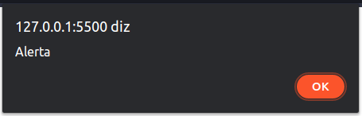
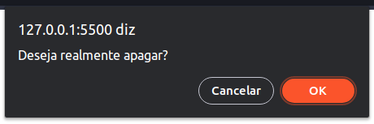
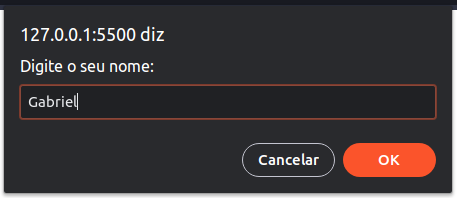

# alert, confirm e prompt (Navegador)

## Alert

### Sintaxe

```js
alert("Alerta");
```

### Exemplo



### OBS

`alert()` é um atalho para o método `window.alert()`

---

## Confirm

### Sintaxe

```js
confirm("Mensagem de confirmação");
```

### Exemplo



### OBS

`confirm()` é um atalho para o método `window.confirm()`

Essa função retorna um valor booleano, sendo `true` quando o usuário clicar no botão `OK` e `false` quando ele clicar no botão `Cancelar`

---

## Prompt

### Sintaxe

```js
prompt("Mensagem");
```

### Exemplo



### OBS

`prompt()` é um atalho para método `window.prompt()`

Essa função retorna o valor inserido na caixa de texto da janela do `prompt` (No exemplo acima, o valor retornado seria `Gabriel`)