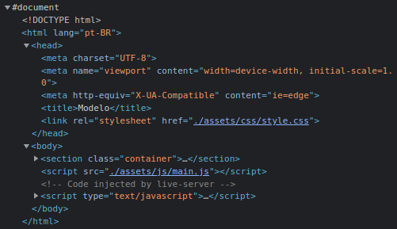

# DOM e a árvore do DOM

> ## DOM

### **Definição**

* **DOM** = Document Object Model = Navegador

* `document` é "filho" do objeto `window`

* É uma interface de objetos que possibilita a manipulação de elementos dentro da página

### **`window.document`**

