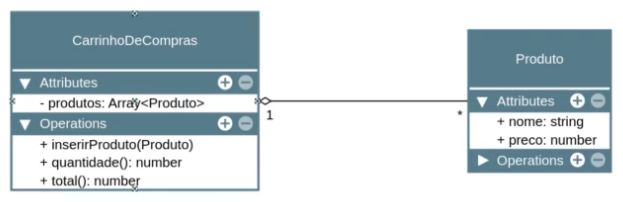

# Agregação entre classes

> ## **Definição**

Agregação é um tipo de associação, assim como a composição.

A principal diferença entre agregação e composição é a **intensidade** da associação, sendo a **agregação a relação mais forte**.

> Lê-se: 1 "Carrinho de Compras" tem 0 ou vários "Produto"



> ## **Exemplo**

```ts
class CarrinhoDeCompras {
  private readonly produtos: Produto[] = [];

  inserirProdutos(...produtos: Produto[]): void {
    for (const produto of produtos) {
      this.produtos.push(produto);
    }
  }

  quatidadeProdutos(): number {
    return this.produtos.length;
  }

  valorTotal(): number {
    return this.produtos.reduce((soma, produto) => soma + produto.preco, 0);
  }
}

class Produto {
  constructor(public nome: string, public preco: number) {}
}

const camiseta = new Produto('Camiseta', 49.9);
const caneca = new Produto('Caneca', 10.9);
const caneta = new Produto('Caneta', 1.9);

const carrinhoDeCompras = new CarrinhoDeCompras();
carrinhoDeCompras.inserirProdutos(camiseta);
carrinhoDeCompras.inserirProdutos(caneca);
carrinhoDeCompras.inserirProdutos(caneta);

console.log(carrinhoDeCompras.valorTotal());

```
