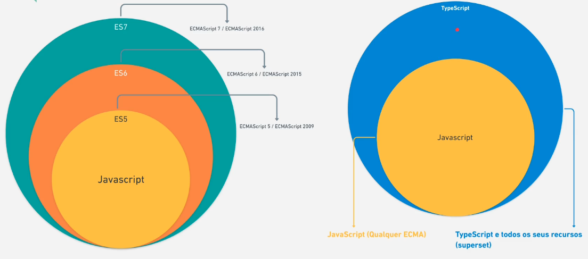
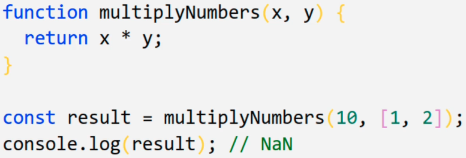
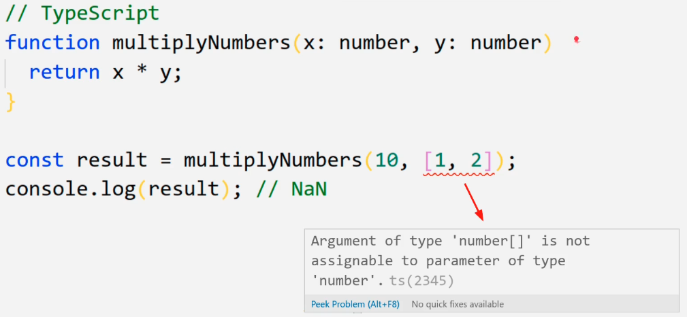
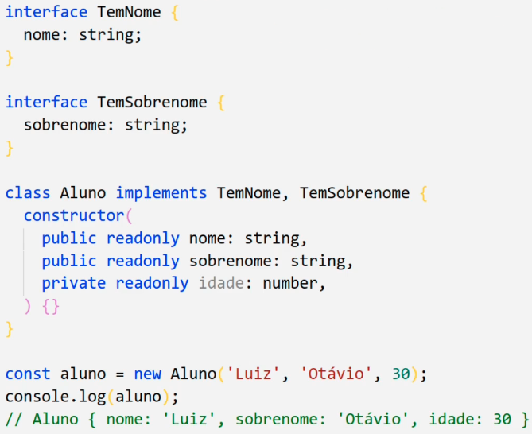
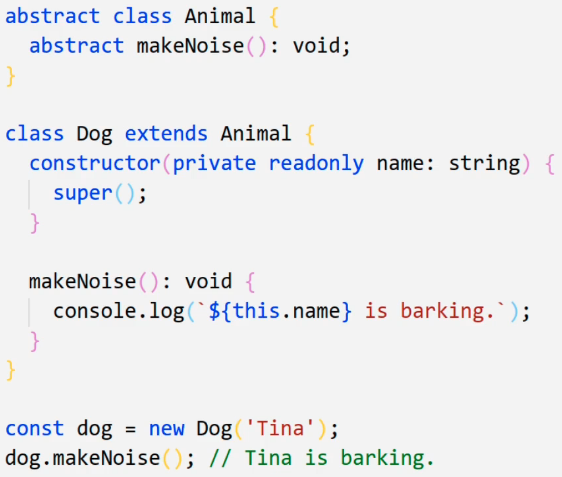
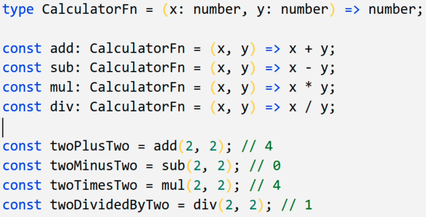
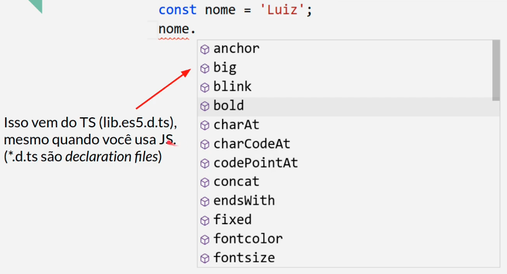
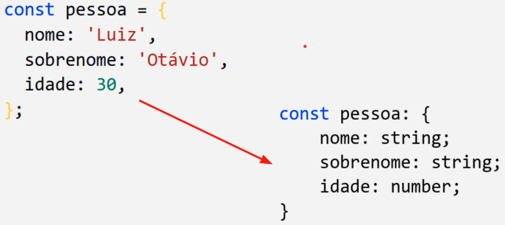

# Introdução ao TypeScript

> ## **Definição**

É um super-conjunto (_superset_) para JavaScript com **tipagem estática**, **novos recursos** e que **compila para JavaScript puro**.

O TypeScript é uma linguagem utilizada **APENAS** em ambiente de desenvolvimento.

> ## **Superset**

### **Definição**

É uma camada externa que adicionar ao JavaScript novas funcionalidades, porém o mesmo não é suportado pelos navegadores e pelo _Node_. Logo, é realizado uma compilação do código fonte escrito em TypeScript para JavaScript, tal processo também é chamado de _transpilação_.

É possível especificar em qual ECMAScript o código fonte (em TypeScript) será compilado.

> ## **Tipagem estática**

### **JavaScript**

Os **erros de tipagem** no JavaScript só aparece em **tempo de execução**.

### **TypeScript**

> ## **Novos recursos**

### **Interfaces**

As **interfaces são "contratos"** definidos em uma classe.

> "Contratos" são membros obrigatórios em todas as classes que a implementam.

### **Classes abstratas**

### **Assinaturas de funções com `type`**

### **"Enums"**

É possível declarar uma espécie de `enum` com TypeScript.

### **_Declaration files_**

Os _declarations files_ (extensão `.d.ts`) são arquivos, que são utilizados pelo VS Code, para disponibilizar ao desenvolvedor JavaScript puro o _code completion_.

### **Inferência de tipos**

O TypeScript modela os tipos de um objeto / variável / etc por meio da **inferência de tipos**.

